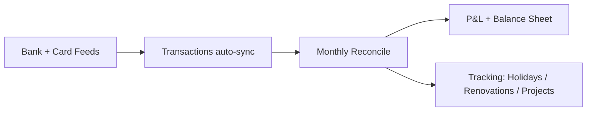

  

    
  

  

If you and your wife share money, you’ve probably lived this life:

- **Two bank apps**
- **A few cards**
- **A spreadsheet you update when you feel guilty**
- And the classic: *“Wait… did we already pay that?”*

Here’s the clever hack: **run your household like a tiny business** (minus the stress).  
**[Xero Simple](https://www.xero.com/uk/pricing-plans/simple/)** gives you a clean system to track everything, automatically.

---

### Why it works so well

Once your **bank accounts + cards are connected**, Xero pulls in transactions automatically.  
Then once a month you just **reconcile** (categorise) them… and suddenly you’ve got:

✅ A proper **Profit & Loss (PnL)** (aka where the money *actually* went)  
✅ A **Balance Sheet** (aka what you own vs what you owe)  
✅ A real view of cashflow without guessing  

It turns “money chats” into “money clarity”.

---

### What you get with Xero Simple (and why it’s perfect for home use)
- **Unlimited bank feeds** (your main accounts, savings, joint cards — all synced)
- **10 sales invoices/month** (perfect for side hustles or odd jobs)
- **Receipt & document uploads** (PDFs/images attached to transactions)
- **Manual journals** (for clean adjustments if you’re detail-oriented)
- **Fixed assets module** (track big purchases properly if you want)
- **Tracking categories 1 & 2** (this is the secret weapon)

> I use tracking to tag spending like **renovations**, **building projects**, **holidays**, and anything else I want to measure without messing up my main categories.

And no, you **can’t create bills** on Simple — but for household finances… honestly? You don’t need to.

---

### Quick note: how to actually get Xero Simple
This plan is typically only available via **[Xero Partners](https://www.xero.com/uk/advisors/)** (for example accountants or bookkeepers on a Xero partner subscription).

So the easiest route is:  
✅ Speak to **any accountant/bookkeeper** who is a Xero Partner — they should be able to help you get set up.

If you’re stuck, **reach out to me** and I can help you get it going.

---

### The best part
For **~£7 + VAT per month**, it’s basically a **full finance dashboard** for your home.

Less chaos.  
More control.  
And fewer “what happened to our money?” moments.

If you want one tool that makes joint finances feel simple, *this is it.*

