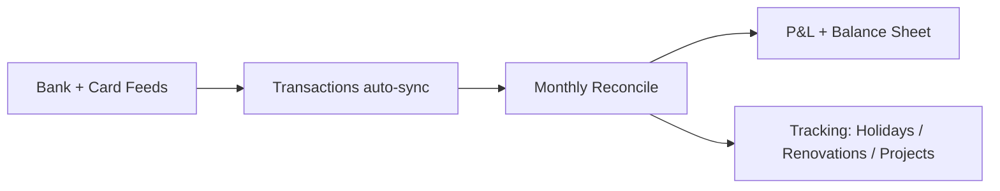

If you and your partner share money, you've probably got two bank apps, a few cards, and a spreadsheet you update when you feel guilty.

The fix: run your household like a tiny business. [Xero Simple](https://www.xero.com/uk/pricing-plans/simple/) connects your accounts, pulls transactions in automatically, and once a month you just categorise them. That gives you:

- a proper profit and loss (where the money actually went)
- a balance sheet (what you own vs what you owe)
- a real view of cashflow

For about £7 + VAT a month, it's basically a full finance dashboard for your home.

A few things worth knowing before you sign up:

- **Unlimited bank feeds**, so every account and card syncs.
- **10 sales invoices a month** — enough for side hustles.
- **Tracking categories** are handy for tagging spending like holidays or renovations without cluttering your main categories.
- **You can't create bills** on Simple, but for household finances you probably won't miss that.

The plan is normally only available through Xero Partners (accountants and bookkeepers). Easiest route is to ask any Xero Partner to set you up — and if you get stuck, reach out and I'll help you get it going.

```mermaid
flowchart LR
  A[Bank + Card Feeds] --> B[Transactions auto-sync]
  B --> C[Monthly Reconcile]
  C --> D["P&L + Balance Sheet"]
  C --> E["Tracking: Holidays / Renovations / Projects"]
```
