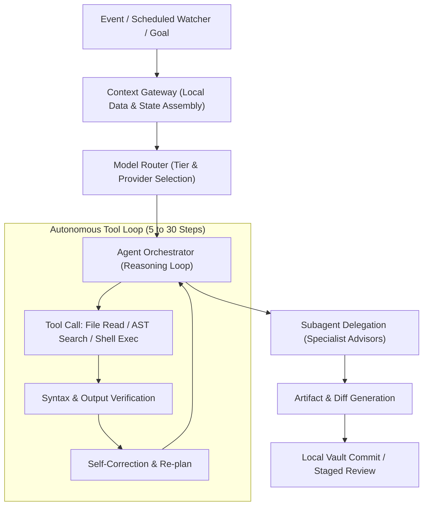
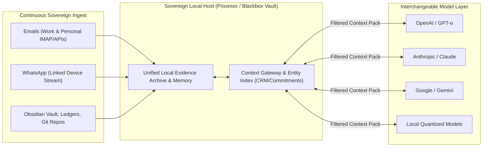

Most people still believe the AI revolution looks like a chat box.

You type a prompt, wait two seconds, and receive three paragraphs of text. In that paradigm, inference—the forward pass where a trained neural network evaluates input and generates output—is treated like a search engine query. One human thought in, one machine answer out. You burn 500 tokens, close the tab, and get on with your day.

If that is your mental model of artificial intelligence, you are preparing for a future that is already obsolete.

Inside my own setup, a single human intent almost never triggers a single inference call. It triggers an avalanche of them. A three-word directive or a scheduled background watcher doesn't generate 500 tokens; it spins up multi-agent loops, context gateways, local embedding retrievers, tool-calling sandboxes, syntax verification steps, and self-correction passes. A single task regularly consumes **500,000 to 5,000,000 tokens** across multiple models before I even look at the final output.

Once you build and live inside an autonomous personal operating system, a chilling realization sets in: **industry analysts, SaaS providers, and the general public have fundamentally miscalculated future inference demand by multiple orders of magnitude.**

Here is what inference actually looks like when you put agents to real work, why the upcoming "Inference Wars" will break the current economics of the tech industry, and why owning your context locally is the ultimate superpower.

---

## 1. The 1:1 Fallacy vs. The 1:10,000 Reality

The modern cloud and SaaS economy was built around a universal ceiling: **the human attention bottleneck**. 

A human can only read so many words per minute, click so many buttons, and keep one browser tab in focus. When frontier AI labs launched their flagship consumer tiers at $20/month, their financial models were anchored to this limit. Even heavy users rarely typed more than 40 or 50 prompts in a single day.

```text
The Chatbot (Mainstream Perception):
User: "Summarize this PDF" 
   └── Model (1 Call, ~800 tokens) ──> User reads response.
```

Now contrast that with what happens inside an agentic infrastructure.

In my environment—spanning Proxmox hypervisors, containerized runtimes, local Syncthing knowledge vaults, continuous communications watchers, and headless agent harnesses like T3 Code, Claude Code, and OpenCode:



When an agent is tasked with refactoring a service or reconciling financial data across disparate APIs:
1. It queries the local context gateway to assemble relevant markdown notes, local schemas, and historical records (15,000 input tokens).
2. It lists directory structures and reads multiple implementation files (50,000 tokens).
3. It writes a temporary script and executes it inside a local container sandbox (10,000 tokens).
4. The script fails on an unexpected type error. The agent reads the stack trace, reflects on why it failed, edits the code, and re-executes (30,000 tokens).
5. It runs unit tests, spots an edge case, invokes a parallel subagent to inspect database migrations, merges the findings, and drafts the pull request (100,000+ tokens).

The token multiplier is not 1:1. **It is 1:1,000 to 1:50,000.**

---

## 2. Inverting the Attention Bottleneck

For sixty years of computing, the machine waited on the human. You clicked; it responded. You saved; it wrote to disk.

Autonomous agents invert this relationship entirely. **The human becomes the supervisor at the tail end of the pipeline, while the machines run continuously ahead of them.**

When you decouple inference from active human typing, demand detaches from human waking hours:

- **Inference is continuous.** Background communication watchers poll every ten minutes. Inbound emails and WhatsApp message streams are ingested into local queues, parsed for urgency, cross-referenced against active project commitments, and drafted into suggested replies before I even unlock my phone.
- **Inference is proactive.** While I sleep, knowledge-librarian agents audit my Obsidian vault, clean up orphan links, normalize newly ingested communications into CRM entities, and stage daily operational summaries.
- **Inference is concurrent.** An orchestrator spawns multiple subagents in parallel workspaces to independently research, test, and critique alternative solutions before presenting a synthesized consensus.

A single developer or finance engineer running an autonomous harness can easily burn through more inference tokens in an afternoon than an entire SME department consumed across all of 2023.

Multiply this across millions of builders, and the demand curve goes vertical.

---

## 3. Owning the Context Locally: Breaking Big Tech Lock-In

Here is the biggest strategic blind spot in the industry: **people believe their AI capability lives inside OpenAI, Google, or Anthropic.**

They entrust their chat histories, documents, project files, and personal memories to closed web interfaces. The moment they do that, they are completely locked in. Switching providers means losing their context, retraining their assistants, and starting from scratch.

Even worse, they blindly paste sensitive emails and client messages into cloud prompt boxes.

In my setup, I treat all model providers as interchangeable commodities. **The intelligence isn't the model. The intelligence is the local context.**



By maintaining my entire second brain, email archives, WhatsApp conversation logs, financial ledgers, codebases, and health tracking in local, plain-text Markdown files and sovereign databases on my own Proxmox server:

1. **Zero Vendor Lock-In**: I am never at the mercy of Google, OpenAI, or Anthropic. If Anthropic raises prices or degrades a model, I flip a config switch in my router to Gemini or an open model. Because the entire context gateway lives on my own machine, the new model is instantly up to speed on every ongoing email thread, WhatsApp relationship, and project milestone without missing a beat.
2. **Absolute Data Sovereignty**: The model never holds my permanent state or communication archive. It receives a temporary, sanitized context pack for a single reasoning pass, returns the structured answer, and my local orchestrator writes the result back into my private vault. My client emails and personal WhatsApp chats never train their future models.
3. **Resilience in the Inference Wars**: If cloud API rate limits spike or frontier providers experience outages during compute shortages, my local infrastructure falls back seamlessly to quantized local models running on self-hosted silicon.

---

## 4. The Local C-Suite: Running Your Own PA, CEO, CFO, and Coach

What most people fail to grasp is that once you manage your context locally, **you are no longer interacting with a generic assistant. You can spin up an entire executive board to run your life and work.**

Because the context gateway can query your actual, private data locally—your full email history, ongoing WhatsApp client discussions, bank balances, Xero accounting ledgers, project hubs, sleep metrics, and family schedules—inference transforms into a personalized C-suite:

* **Your Personal Assistant (PA)**: Connects to your email and WhatsApp watchers. It knows who your key contacts are from your local CRM index, flags promised deliverables hidden in message threads, drafts contextual replies in your exact tone of voice, and empties your communications inbox every morning.
* **Your Chief Financial Officer (CFO)**: Queries your real-time accounting transactions, matches inbound invoice emails to bank lines, monitors personal cash runway, checks tax compliance, reconciles monthly statements, and projects cash flow before you make major purchases.
* **Your Chief Executive Officer (CEO)**: Audits your active projects against incoming requests from stakeholders over email and WhatsApp, spots commitment creep, ruthlessly prunes low-leverage distractions, and prepares your weekly operating rhythm.
* **Your Chief Technology Officer (CTO)**: Reviews your homelab infrastructure, runs automated regression tests on your code, audits architecture diffs, and plans database migrations.
* **Your Health & Performance Coach**: Cross-references your sleep micro-arousals, training logs, and weekly stress metrics against your heavy meeting days from your calendar and communications stream, telling you when to push hard in training and when to take a rest day.

None of this is possible if your communications and data are locked away in siloed SaaS apps or generic web chats. It only works because **every inference call queries your own authoritative, unified local data.** 

The models don't need to know you forever; they just need to be handed the perfect local context at the exact moment of execution.

---

## 5. The Battlefield: Why the "Inference Wars" Are Inevitable

Every major AI lab spent 2023 through 2025 obsessing over **pre-training compute**: 100,000-GPU clusters, multi-gigawatt power negotiations, and multi-billion-dollar foundational training runs.

Training is an upfront capital expenditure; **inference is the continuous operational tax of the new economy**. Training produces the asset; inference delivers the utility. And inference is where the unit economics are about to collide with reality.

### A. The Collapse of Flat-Rate SaaS
The $20/month all-you-can-eat subscription is a dead business model walking. It only works as long as humans are slowly pecking at keys. 

The moment power users hook their accounts up to agentic CLI harnesses that chew through 20 million tokens a day, every flat-rate seat becomes deeply underwater for the provider. We are already seeing aggressive rate-limiting, strict weekly caps, and hidden throttling. The future is pure consumption-based billing: dynamic compute credits, differentiated rates for reasoning vs. speculative tokens, and strict concurrency gates.

### B. The Memory Bandwidth & KV Cache Wall
Generating tokens sequentially is fundamentally memory-bandwidth bound. As multi-step agent loops pass massive system contexts, tool definitions, and long execution histories back and forth, cloud data centers run headfirst into brutal **KV-cache contention**.

The competitive advantage will not just be who has the smartest model, but who can serve millions of multi-turn agent contexts with minimal time-to-first-token (TTFT) and sustainable margins. This explains the frantic race toward custom inference silicon, wafer-scale engines, speculative decoding, and native prompt caching.

### C. The Grid and Energy Ceiling
If the entire world uses AI as a faster Google Search, utility grids can cope. 

If the knowledge workforce deploys swarms of persistent, autonomous agents operating across codebases, databases, and communication channels 24 hours a day, the aggregate energy requirements will outstrip data center power allocations in major metropolitan regions. Compute access will increasingly be rationed.

---

## 6. The Realization

Right now, tech commentators are locked in debates over whether LLM benchmark progress is slowing down.

They are staring at the wrong metric.

Even if frontier models didn't get one bit smarter over the next eighteen months:

> **The structural transition from human-driven chat interfaces to autonomous, background, tool-calling agentic infrastructure represents a 10,000x surge in global token demand.**

Those of us building inside agentic loops already see the writing on the wall. We watch our harnesses burn millions of tokens before breakfast just to keep our systems synchronized, our inbox and WhatsApp triaged, our finances reconciled, and our personal C-suite operational.

The mainstream tech world is still budgeting for a future where people ask chatbots for dinner recommendations.

They have no idea what happens when millions of autonomous agents wake up, start working, and never shut off.
