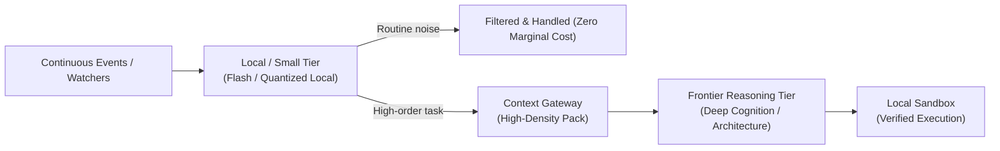

Most people still believe the AI revolution looks like a chat box.

You type a prompt, wait two seconds, and receive three paragraphs of text. In that paradigm, inference—the forward pass where a trained neural network evaluates input and generates output—is treated like a search engine query. One human thought in, one machine answer out. You burn 500 tokens, close the tab, and get on with your day.

If that is your mental model of artificial intelligence, you are preparing for a future that is already obsolete.

Inside my own setup, a single human intent almost never triggers a single inference call. It triggers an avalanche of them. A three-word directive or a scheduled background watcher doesn't generate 500 tokens; it spins up multi-agent loops, context gateways, local embedding retrievers, tool-calling sandboxes, syntax verification steps, and self-correction passes. A single task regularly consumes **500,000 to 5,000,000 tokens** across multiple models before I even look at the final output.

Once you build and live inside an autonomous personal operating system, a chilling realization sets in: **industry analysts, SaaS providers, and infrastructure planners have fundamentally miscalculated future inference demand by multiple orders of magnitude.**

Here is what inference actually looks like when you put agents to real work, and why the upcoming "Inference Wars" will break the current economics of the tech industry.

---

## 1. The 1:1 Fallacy vs. The 1:10,000 Reality

The modern cloud and SaaS economy was built around a universal ceiling: **the human attention bottleneck**. 

A human can only read so many words per minute, click so many buttons, and keep one browser tab in focus. When frontier AI labs launched their flagship consumer tiers at $20/month, their financial models were anchored to this limit. Even heavy users rarely typed more than 40 or 50 prompts in a single day.

```text
The Chatbot (Mainstream Perception):
User: "Summarize this PDF" 
   └── Model (1 Call, ~800 tokens) ──> User reads response.
```

Now contrast that with what happens inside an agentic infrastructure.

In my environment—spanning Proxmox hypervisors, containerized runtimes, local Syncthing knowledge vaults, and headless agent harnesses like T3 Code, Claude Code, and OpenCode:


When an agent is tasked with refactoring a service or reconciling financial data across disparate APIs:
1. It queries the local context gateway to assemble relevant markdown notes and schemas (15,000 input tokens).
2. It lists directory structures and reads multiple implementation files (50,000 tokens).
3. It writes a temporary script and executes it inside a container sandbox (10,000 tokens).
4. The script fails on an unexpected type error. The agent reads the stack trace, reflects on why it failed, edits the code, and re-executes (30,000 tokens).
5. It runs unit tests, spots an edge case, invokes a parallel subagent to inspect database migrations, merges the findings, and drafts the pull request (100,000+ tokens).

The token multiplier is not 1:1. **It is 1:1,000 to 1:50,000.**

---

## 2. Inverting the Attention Bottleneck

For sixty years of computing, the machine waited on the human. You clicked; it responded. You saved; it wrote to disk.

Autonomous agents invert this relationship entirely. **The human becomes the supervisor at the tail end of the pipeline, while the machines run continuously ahead of them.**

When you decouple inference from active human typing, demand detaches from human waking hours:

- **Inference is continuous.** Background communication watchers run on fixed cadences. They ingest inbound messages, resolve contact identities against a CRM index, flag commitments, and draft proposed responses without anyone sitting at a keyboard.
- **Inference is proactive.** While I sleep, knowledge-librarian agents audit my Obsidian vault, clean up orphan links, normalize newly ingested documents into structured schemas, and stage daily operational summaries.
- **Inference is concurrent.** An orchestrator spawns multiple subagents in parallel workspaces to independently research, test, and critique alternative solutions before presenting a synthesized consensus.

A single developer or finance engineer running an autonomous harness can easily burn through more inference tokens in an afternoon than an entire SME department consumed across all of 2023.

Multiply this across millions of builders, and the demand curve goes vertical.

---

## 3. The Battlefield: Why the "Inference Wars" Are Inevitable

Every major AI lab spent 2023 through 2025 obsessing over **pre-training compute**: 100,000-GPU clusters, multi-gigawatt power negotiations, and multi-billion-dollar foundational training runs.

Training is an upfront capital expenditure; **inference is the continuous operational tax of the new economy**. Training produces the asset; inference delivers the utility. And inference is where the unit economics are about to collide with reality.

### A. The Collapse of Flat-Rate SaaS
The $20/month all-you-can-eat subscription is a dead business model walking. It only works as long as humans are slowly pecking at keys. 

The moment power users hook their accounts up to agentic CLI harnesses that chew through 20 million tokens a day, every flat-rate seat becomes deeply underwater for the provider. We are already seeing aggressive rate-limiting, strict weekly caps, and hidden throttling. The future is pure consumption-based billing: dynamic compute credits, differentiated rates for reasoning vs. speculative tokens, and strict concurrency gates.

### B. The Memory Bandwidth & KV Cache Wall
Generating tokens sequentially is fundamentally memory-bandwidth bound. As multi-step agent loops pass massive system contexts, tool definitions, and long execution histories back and forth, cloud data centers run headfirst into brutal **KV-cache contention**.

The competitive advantage will not just be who has the smartest model, but who can serve millions of multi-turn agent contexts with minimal time-to-first-token (TTFT) and sustainable margins. This explains the frantic race toward custom inference silicon, wafer-scale engines, speculative decoding, and native prompt caching.

### C. The Grid and Energy Ceiling
If the entire world uses AI as a faster Google Search, utility grids can cope. 

If the knowledge workforce deploys swarms of persistent, autonomous agents operating across codebases, databases, and communication channels 24 hours a day, the aggregate energy requirements will outstrip data center power allocations in major metropolitan regions. Compute access will increasingly be rationed.

---

## 4. The Blueprint: How We Run High-Volume Inference Today

If token consumption is exploding, how do you build an agentic setup without going bankrupt or constantly hitting vendor rate limits?

The answer is **hybrid model routing and sovereign edge infrastructure**.

No single model should touch every step of your workflow. In our setup:



### 1. Fast Triage at the Edge (Small & Local Models)
Routine chores—parsing emails, deduplicating notes, classifying webhooks, extracting JSON entities—never get routed to expensive frontier reasoning models. They are handled by fast, lightweight flash models or local quantized models running on private hardware. They filter 80% of the raw volume at near-zero marginal cost.

### 2. The Context Gateway
Never dump your entire repository or vault into an LLM prompt. Before an agent touches an API, a local context gateway compiles a distilled, high-density evidence pack containing only the active project hub, relevant schemas, and recent state notes. This keeps context windows lean, reduces latency, and slashes token waste.

### 3. Frontier Models as Surgical Scalpels
Heavyweight reasoning models (Claude Opus, Gemini Pro, GPT-o-series) are reserved strictly for high-order cognition: architectural planning, tricky debugging loops, complex mathematical modeling, and final synthesis. They act as senior architects, not data entry clerks.

### 4. Local Sandboxes & Sovereign State
All tool execution—running bash scripts, modifying files, executing database queries—happens locally inside containerized sandboxes with explicit human-approval gates for destructive actions. The raw data lives in our own storage; only the immediate reasoning context leaves the perimeter.

---

## 5. The Realization

Right now, tech commentators are locked in debates over whether LLM benchmark progress is slowing down.

They are staring at the wrong metric.

Even if frontier models didn't get one bit smarter over the next eighteen months:

> **The structural transition from human-driven chat interfaces to autonomous, background, tool-calling agentic infrastructure represents a 10,000x surge in global token demand.**

Those of us building inside agentic loops already see the writing on the wall. We watch our harnesses burn millions of tokens before breakfast just to keep our systems synchronized, our code tested, and our context curated.

The mainstream tech world is still budgeting for a future where people ask chatbots for dinner recommendations.

They have no idea what happens when millions of autonomous agents wake up, start working, and never shut off.
